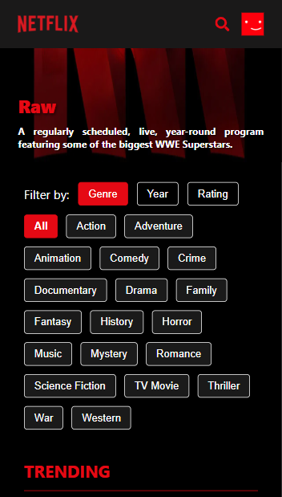

# Netflix Clone App

A modern and responsive movie browsing app built with **React**, **Vite**, **TypeScript**, **React Query**, and **Axios**. This project integrates with **The Movie Database (TMDB)** API to allow users to:

### Features

- Browse **Trending** and **Top Rated** movies  
- Explore all movie categories  
- Search for movies  
- View detailed movie information including trailers  
- Enjoy a **responsive design** optimized for all devices  
- Tested using **Jest** and **React Testing Library**

### Links

- Code URL: (https://github.com/agneja00/Netflix-clone)
- Live Site URL: (https://netflix-clone-app-mauve-two.vercel.app/)

### Built with

- React vite
- Typescript
- SASS
- React Testing Library
- Jest
- React Query
- Axios
- Vercel

## Author

- Website - [Agnieska Jackevic] (https://web-portfolio-agneja00.vercel.app/)
- Linkedin - [Agnieska Jackevic] (https://www.linkedin.com/in/agnieska-jackevic/)

